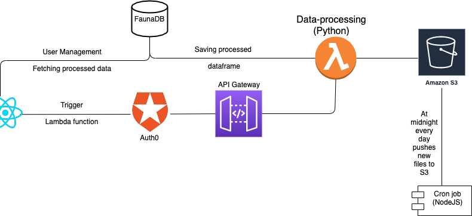
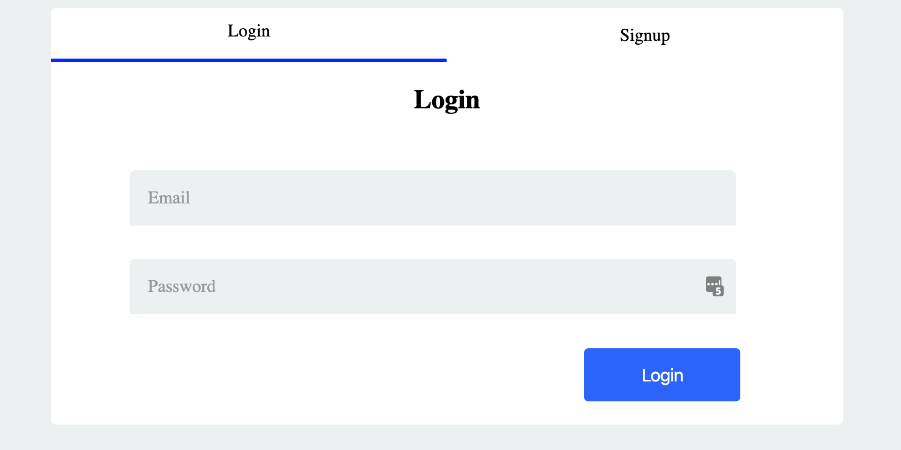
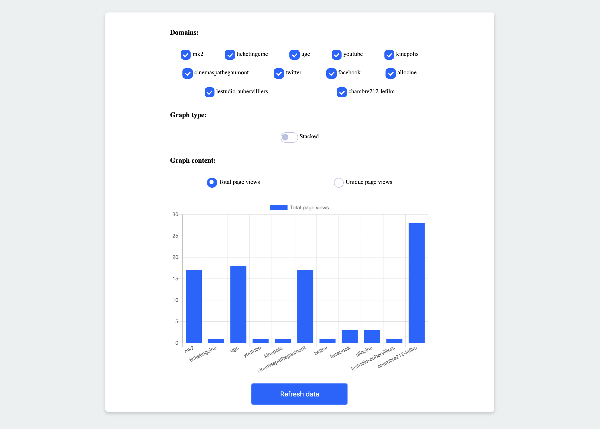
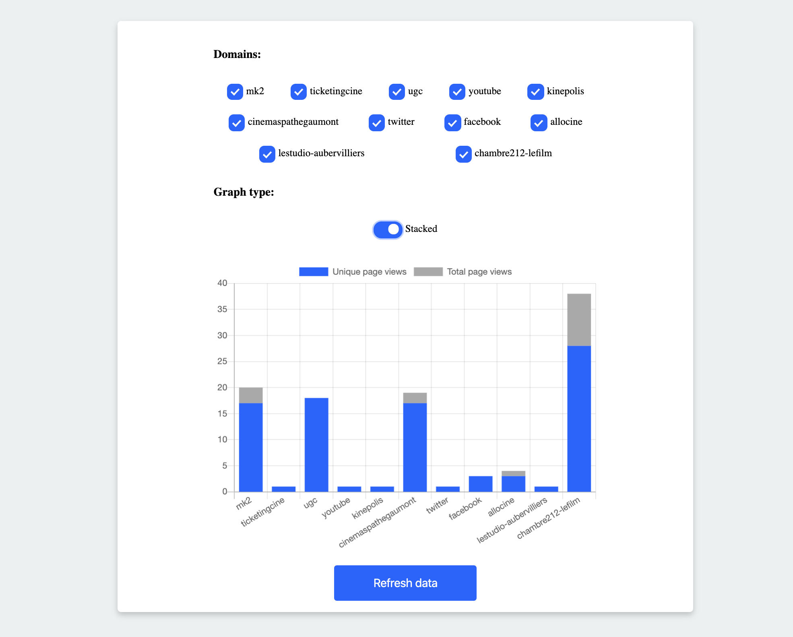

# Balthus exercice

## Points to improve
* The lambda function should be triggered when the bucket in S3 changes, that would be more cost effective
* Add a backend for user management

## Architecture

## Showcase

### The login page

### The main page
**Bar graph:**

**Stacked bar graph:**

